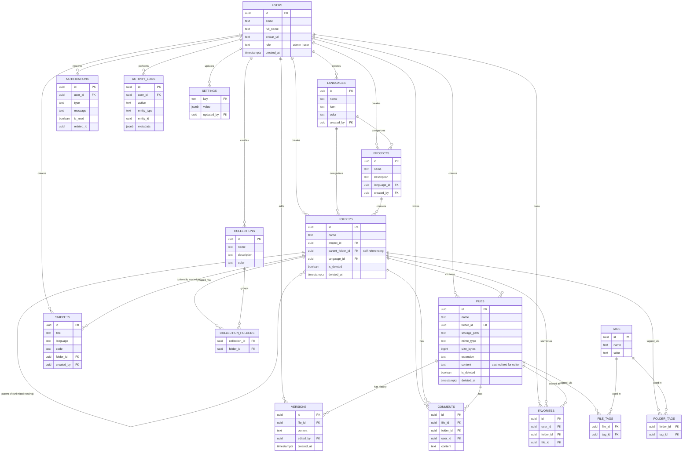

# Database ER Diagram

## Notes
- Every foreign key to `users` is nullable-on-delete-set-null or cascade, matching `supabase/migrations/001_init_schema.sql` exactly.
- `folders.parent_folder_id` is self-referencing with `ON DELETE CASCADE`, which is what gives unlimited nesting and makes deleting a folder also delete its full subtree.
- `folder_tags` / `file_tags` and `collection_folders` are junction tables enabling many-to-many relationships (a folder can have many tags, a tag can be on many folders; a folder can be in many collections).
